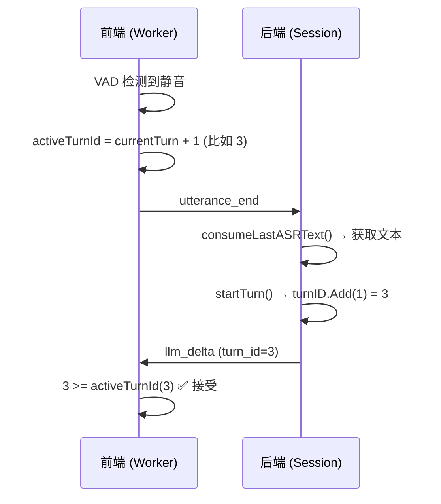
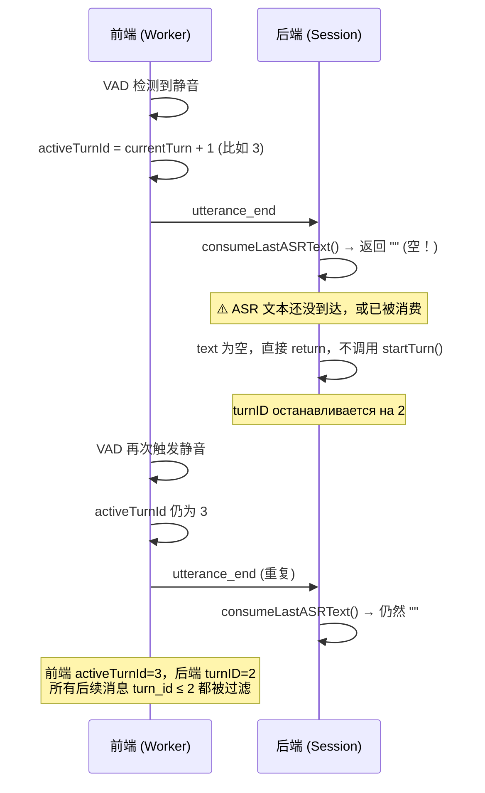

# AI 不回复 Bug 根因分析

## 根本原因：前端 `activeTurnId` 与后端 `turnID` 的竞态条件

AI 不回复的核心问题是：**前端在用户说完话时立即递增 `activeTurnId`，但此时后端可能还没有成功启动对应的新 turn，导致后端返回的所有响应都被前端过滤为"过时消息"。**

---

## 详细分析

### 正常流程


### Bug 触发场景



### 日志中的证据

#### 场景一 (04:04 - 04:05)

```
04:04:20 - turn 12 的消息仍在到达 (tts_chunk, llm_final)
04:04:21 - "Stale msg dropped: type=tts_chunk turn=12 (active=13)"
          → 前端已将 activeTurnId 设为 13
04:04:23 - "Stale msg dropped: type=llm_final turn=12 (active=13)"
04:04:24 - 多次 "utterance_end sent via worker VAD (activeTurnId -> 13)"
          → VAD 反复触发，每次都发 utterance_end 给后端
04:04:46 - "error code=asr_failed message=...i/o timeout"
          → ASR 连接超时，没有新的文本到达
          → 后端 consumeLastASRText() 始终返回空
          → turnID 始终留在 12，永远追不上 activeTurnId=13
04:05:45 - ws closed → 最终连接断开
```

#### 场景二 (04:08 - 04:09)

```
04:09:13 - turn 2: "status=Thinking detail=ai is thinking"
04:09:17 - "utterance_end sent via worker VAD (activeTurnId -> 3)"
          → 用户在 AI 还在思考时又说了话(或VAD误触)
          → 前端 activeTurnId 跳到 3
04:09:22 - 大量 "Stale msg dropped: type=llm_delta turn=2 (active=3)"
          → turn 2 的所有 LLM 回答被丢弃！
04:09:34 - "Stale msg dropped: type=llm_final turn=2 (active=3)"
04:09:35 - 再次 "utterance_end sent via worker VAD (activeTurnId -> 3)"
          → 但此时后端可能没有有效的 ASR 文本
          → turn 3 从未真正启动
```

---

## 根本问题总结

| 问题 | 说明 |
|------|------|
| **activeTurnId 单方面递增** | 前端 Worker 的 VAD 触发 `utterance_end` 时，立即将 `activeTurnId` 设为 `currentTurn + 1`，但**不检查后端是否会真正启动新 turn** |
| **consumeLastASRText() 可能为空** | 后端收到 `utterance_end` 时，如果 ASR 尚未产出文本（或文本已被消费），[consumeLastASRText()](file:///Users/zhyuzh/BaiduTongbu/2026.03.03kagent/kagent/internal/session.go#456-463) 返回空字符串，[startTurn()](file:///Users/zhyuzh/BaiduTongbu/2026.03.03kagent/kagent/internal/session.go#262-289) 不会执行 |
| **VAD 重复触发** | Worker 的 `setInterval(100ms)` 持续检测静音，可能多次发送 `utterance_end`，但前端只在第一次递增 `activeTurnId`（因为之后 `utteranceActive` 已为 false） |
| **ASR 故障加剧** | 当 ASR 超时断连（如 `asr_failed i/o timeout`），重连期间没有新文本，所有 `utterance_end` 都不会触发新 turn |

> [!CAUTION]
> 这不是窗口是否激活的问题。核心是前端 `activeTurnId` 和后端 `turnID` 之间缺乏同步机制。只要 VAD 触发了 `utterance_end` 但后端没有有效文本，就会出现"AI 不回复"的情况。

---

## 修复建议

### 方案 A：后端确认 turn 启动（推荐）

后端在 [handleControl("utterance_end")](file:///Users/zhyuzh/BaiduTongbu/2026.03.03kagent/kagent/internal/session.go#170-199) 中，即使文本为空也返回一个 `turn_nack` 事件。前端收到 `turn_nack` 后回滚 `activeTurnId`：

**后端修改** ([session.go](file:///Users/zhyuzh/BaiduTongbu/2026.03.03kagent/kagent/internal/session.go#L189-L194)):
```diff
 case "utterance_end":
     text := s.consumeLastASRText()
     if text == "" {
+        _ = s.sendEvent(NewTextEvent("turn_nack", s.turnID.Load(), ""))
         return
     }
     s.startTurn(text)
```

**前端修改** ([index.html](file:///Users/zhyuzh/BaiduTongbu/2026.03.03kagent/kagent/webui/index.html#L541-L572) [handleEvent](file:///Users/zhyuzh/BaiduTongbu/2026.03.03kagent/kagent/webui/index.html#541-573)):
```diff
+if (type === 'turn_nack') {
+    // 后端没有启动新 turn，回滚 activeTurnId
+    App.activeTurnId = App.currentTurn;
+    appendDebug(`turn_nack: rolled back activeTurnId to ${App.activeTurnId}`);
+    return;
+}
```

### 方案 B：前端延迟递增 activeTurnId

不在 `vad_utterance_end` 时立即递增 `activeTurnId`，而是等到收到后端的 `status=Thinking` 时才递增：

```diff
 // 在 handleEvent 的 status 处理中
 if (type === 'status') {
+    if (v === 'Thinking' && msg.turn_id > App.activeTurnId) {
+        App.activeTurnId = msg.turn_id;
+    }
     ...
 }
 
 // 在 vad_utterance_end 处理中
 case 'vad_utterance_end':
-    App.activeTurnId = App.currentTurn + 1;
     App.utteranceActive = false;
     App.sustainedHighRmsCount = 0;
```

### 方案 C：VAD 重复触发防护

给 Worker 中增加防重复机制，避免在没有新语音输入的情况下重复发送 `utterance_end`：

```diff
 // Worker code
+let lastUtteranceEndAt = 0;
 
 if (Date.now() - lastVoiceAt >= UTTERANCE_SILENCE_MS) {
     utteranceActive = false;
+    if (Date.now() - lastUtteranceEndAt < 2000) return; // 2秒内不重复
+    lastUtteranceEndAt = Date.now();
     sendControl('utterance_end');
     self.postMessage({ type: 'vad_utterance_end' });
 }
```

> [!TIP]
> **推荐组合使用方案 A + C**。方案 A 从根本上修复了前后端 turn ID 不同步的问题，方案 C 减少了不必要的 `utterance_end` 请求。
