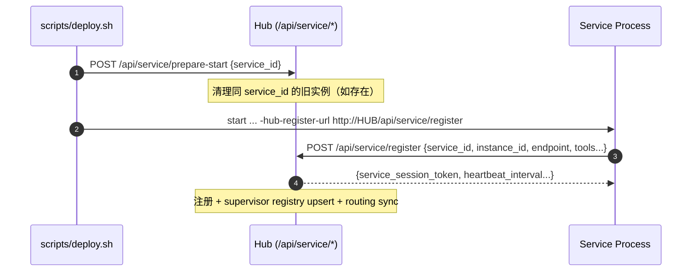
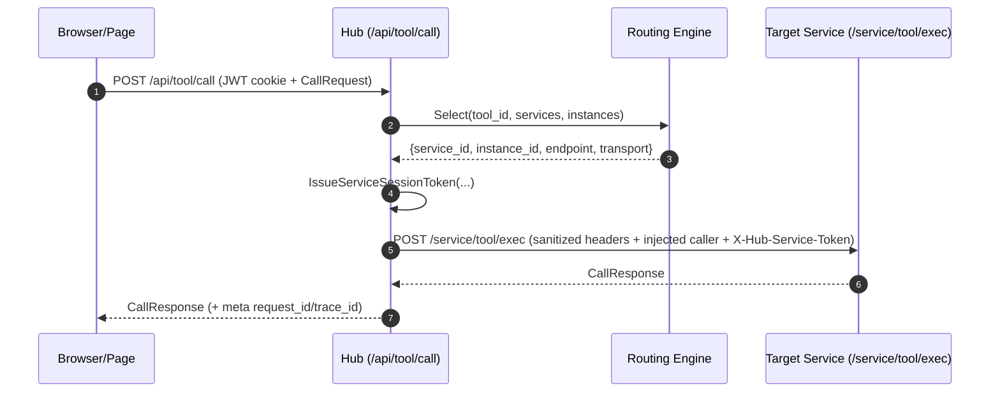

# Kagent 核心架构理念与概念白皮书 (260316)

- 文档类型：分析 / 理念白皮书（ANA）
- 适用范围：以 **2026-03-16** 仓库与脚本的“真实可运行形态”为准（Hub + 多独立 Service）
- 参考：
  - `plan/260316-hub-service-platform-architecture-prd.md`
  - `plan/260316-kagent-architecture-philosophy-ana.md`（本文件上一版）
- 核验依据（可追溯文件）：
  - 部署与进程编排：`scripts/deploy.sh`、`scripts/reset_db.sh`
  - Hub：`hub/cmd/hub/main.go`、`hub/internal/app/*`、`hub/internal/gateway/tool_handler.go`、`hub/internal/security/headers.go`、`hub/internal/routing/*`、`hub/internal/transport/client.go`
  - 协议：`pkg/toolproto/*`、`pkg/hubsvc/session.go`
  - Services：`services/*/cmd/*/main.go`、`services/surface-manager/internal/app/surface_catalog.go`

---

## 1. 这份文档解决什么问题

本白皮书回答三类问题：

1) **边界**：Page/Surface、Hub、Service 各自“必须做什么 / 绝对不做什么”。  
2) **不变量**：哪些约束是为了长期演进而设（任何新功能都不能破坏）。  
3) **可演进路径**：当我们新增 Service / 新增 Tool / 新增 Surface 时，应该如何接入，避免重新耦合回单体。

> 重要说明：本文件同时覆盖“已落地现状（As-Is）”与“目标理念（To-Be）”。凡是 **未在代码/脚本中落地** 的内容，都会标注为 **To-Be** 或 **待确认**，避免把愿景写成事实。

---

## 2. 架构快照（As-Is / 2026-03-16 核验）

### 2.1 运行时进程拓扑

`kagent` 当前由 1 个 Hub + 5 个独立 Service 组成（由 `scripts/deploy.sh` 启动）：

- Hub：`hub/cmd/hub/main.go`（默认 `127.0.0.1:18080`）
- Services（均为独立进程，默认 loopback 端口）：
  - `ai-doubao`（`127.0.0.1:18081`）
  - `chat-server`（`127.0.0.1:18082`）
  - `file-service`（`127.0.0.1:18084`）
  - `database-service`（`127.0.0.1:18085`）
  - `surface-manager`（`127.0.0.1:18086`）

> 备注：仓库中存在 `services/auth/`，但 **部署脚本未构建/启动该进程**；当前认证逻辑 **在 Hub 进程内实现**（见 `hub/internal/app/auth.go` 与 `hub/cmd/hub/main.go` 的 `/api/auth/*`）。

### 2.2 对外接口分层（谁能被谁访问）

- Browser / Page：只应访问 Hub（Hub 同时托管静态资源与 API）。
- Service：只接受来自 Hub 的“工具执行调用”（通过 `X-Hub-Service-Token` 校验），以及健康/关停控制面。
- Hub 的 Supervisor API：只允许 loopback 调用（服务注册、心跳等），用于本地多进程治理。

---

## 3. 三层协作模型：Page（含 Surface） / Hub / Service

本项目的核心是 **“交互在前端，治理在 Hub，执行在 Service”**。PRD 中的 Page-Hub-Service 分层在当前形态下进一步细化为：

### 3.1 Page（表现层 / 决策者）

**Page 是交互与编排的“决策者”**，负责：
- 用户交互与多模块协调（例如 chat 页面与 surface 容器的协作）。
- **Client-Driven 决策**（As-Is）：例如前端 VAD、打断（Interrupt）等关键交互节点由前端触发与仲裁（见 `webui/page/chat/io-worker.js`、`webui/page/chat/audio-capture.js` 的 VAD/interrupt 相关实现）。
- 将“要做什么”表达成 **工具调用（Tool Call）**，而不是直接耦合到某个后端进程/端口。

### 3.2 Surface（插件化 UI / 受控执行者）

Surface 是被 Page 挂载的动态 UI 组件，关键特征：
- **可被扫描与编目**（As-Is）：由 `surface-manager` 扫描 `webui/surface/<buildin|ext|custom>/...` 并维护 catalog（见 `services/surface-manager/internal/app/surface_catalog.go`）。
- 以“受控能力（Capability）”方式获取访问权限（理念与 PRD 对齐；具体 token/校验机制见第 6 章）。

> To-Be：Surface 应当只能拿到其所需最小权限，且权限应具备明确范围（scope + path prefix + TTL），避免“插件即超级权限”。

### 3.3 Hub（平台内核 / 治理与边界）

Hub 是唯一的枢纽与安全边界（As-Is 的关键实现集中在 `hub/cmd/hub/main.go` 与 `hub/internal/*`）：

- **统一入口**：托管静态资源并默认重定向到 `/page/chat/`。
- **认证中心（As-Is）**：在 Hub 内提供 `/api/auth/*`，签发/解析 JWT（见 `hub/internal/app/auth.go`）。
- **工具网关**：
  - HTTP：`POST /api/tool/call`（见 `hub/internal/gateway/tool_handler.go`）
  - WS（chat 工具流）：`GET /api/tool/ws`（Hub 反代到 `chat-server` 的 `/service/tool/ws`，并注入受保护 headers）
- **服务治理（Supervisor / As-Is）**：提供 loopback-only 的 Service 注册/心跳/退场协议（`/api/service/*`）。
- **路由与绑定（As-Is）**：维护 `tool_id -> service` 的选择与绑定策略（`hub/internal/routing/*` + `hub/internal/app/hub_platform.go` 持久化）。

### 3.4 Service（能力执行层 / 原子能力与协调者）

Service 分两类（PRD 的理念在本项目同样成立）：

- **原子能力提供者（Atomic Provider）**：例如 `ai-doubao`，只做 ASR/LLM/TTS 等能力执行，不承载上层业务状态机。
- **业务协调者（Coordinator）**：例如 `chat-server`，承载业务状态/编排，调用底层原子能力（As-Is：`chat-server` 通过工具协议向下游能力发起调用，相关逻辑集中在 `services/chat-server/internal/app/*`）。

所有 Service 在运行时都应满足一个最小“平台契约”（As-Is）：
- `GET /healthz`：健康检查
- `POST /admin/shutdown`：优雅退出入口（供 Hub/脚本调用）
- `POST /service/tool/exec`：工具执行入口（接受 Hub 注入的受保护 headers，并校验 `X-Hub-Service-Token`）
- （可选）`GET /service/info`、`GET /service/tools`：自描述/调试用

---

## 4. 架构不变量（Architecture Laws）

这些约束是为了让系统长期保持“可拆、可插、可演进”，任何新功能都不应破坏：

1) **逻辑路径优先（Logic > Physics）**  
   业务只面向 `tool_id`（例如 `ai.llm.stream`、`storage.file.read`），不面向“某个端口/某个进程”。  
   Hub 负责把逻辑调用映射到具体 Service 实例。

2) **所有跨 Service 的业务协作必须可被 Hub 治理**  
   实践形式：统一通过 Hub 的工具网关进行（Service 侧仅接受携带 `X-Hub-Service-Token` 的调用）。  
   目标：把“服务发现、路由选择、审计、熔断/降级”收敛到 Hub。

3) **受保护 headers 只能由 Hub 注入**  
   Hub 在转发时会先 Sanitization，再 Inject（见 `hub/internal/security/headers.go`），避免调用方伪造 caller 身份/trace。

4) **本地多进程必须可控：启动冲突可清理、退出可级联**  
   As-Is：
   - 启动前清理：`POST /api/service/prepare-start`（脚本会对每个 service 调用）
   - Hub 退出级联：Hub 会尝试调用 service `/admin/shutdown`，并在必要时 SIGTERM/SIGKILL（见 `hub/cmd/hub/main.go` 的 `broadcastServiceShutdown` / `stopServiceRegistration`）

5) **状态归属清晰：谁拥有数据，谁就承担一致性责任**  
   例如：Hub 负责 auth user store 与路由状态；`chat-server` 负责聊天业务数据；`surface-manager` 负责 surface catalog 与相关运行态。

---

## 5. 协议与关键调用路径（As-Is）

### 5.1 Service 启动与注册（Supervisor 流）

关键点（As-Is）：
- `/api/service/*` 仅允许 loopback（Hub 会检查 remote addr）。
- 注册返回 `service_session_token`（供 Hub->Service 调用时使用；服务侧必须校验）。

### 5.2 工具调用（Page -> Hub -> Service）

关键点（As-Is）：
- Hub 会根据 JWT 解析 caller，并生成/补齐 `request_id`/`trace_id`。
- Hub 会将调用审计与路由统计落到自身（见 `hub/internal/observability/audit.go` 与 `hub/internal/app/hub_platform.go` 的 stats/bindings 持久化）。

### 5.3 工具流（WS：Hub -> chat-server）

- Page 访问 `GET /api/tool/ws`（Hub 校验 JWT）。
- Hub 选择 `chat-server` 并签发 `X-Hub-Service-Token`，反代到 `chat-server` 的 `GET /service/tool/ws`（见 `hub/cmd/hub/main.go` 的 `buildServiceToolWSProxy`）。

### 5.4 关停与冲突清理（Hub 主导）

- 脚本与 Hub 均可调用 `POST /admin/shutdown` 触发优雅退出。
- Hub 的级联关停策略（As-Is）：
  1) 先尝试调用 service 的 `/admin/shutdown`
  2) 若超时仍存活，SIGTERM
  3) 再超时，SIGKILL

---

## 6. 安全模型与隔离（As-Is + To-Be 分层）

### 6.1 令牌类型（As-Is）

1) **用户 JWT（Hub 内签发）**  
- 存放于 Cookie：`kagent_token`（见 `hub/internal/app/auth.go`）

2) **Service Session Token（Hub 签发，Service 校验）**  
- Header：`X-Hub-Service-Token`  
- 签名：HMAC（shared secret 存于 `data/.service_secret`，Hub 与各 service 共享；见 `hub/internal/app/hub_platform.go` 与 `pkg/hubsvc/session.go`）

3) **SurfaceFS Token（由 surface-manager 生成/校验，用于 surface 受控文件访问）**  
- `surface-manager` 内部有 `SurfaceFSService`，基于 `data/.surface_secret` 生成 session/capability token，并用 scope/path_prefix 做校验（见 `services/surface-manager/internal/app/surfacefs.go`）

> 重要澄清：上一版文档把“Capability Token”表述为“Hub 直接签发给 Surface”。As-Is 的实现更准确的表述是：**Hub 负责把调用路由到 surface-manager；surface-manager 负责具体 token 的生成与校验**。

### 6.2 Caller Context（As-Is）

Hub 会注入 caller 与追踪 headers（见 `hub/internal/security/headers.go`）：
- `X-Hub-Request-Id` / `X-Hub-Trace-Id`
- `X-Caller-Type` / `X-Caller-User-Id` / `X-Caller-Service-Id` / `X-Caller-Surface-Id`
- `X-Hub-Service-Token`

Service 端会以此作为“谁在调用我”的唯一可信来源，并拒绝缺失/伪造（见各 service 的 `/service/tool/exec` 对 `X-Hub-Service-Token` 的校验）。

### 6.3 Scope Isolation（As-Is 与 To-Be）

- As-Is（已落地的一部分）：
  - **Service 侧零信任**：Service 不信任外部 caller 自己宣称的身份；只接受 Hub 注入的 headers + token。
  - **surface-manager 的能力隔离**：通过 capability 的 scope/path_prefix 约束 surface 文件访问范围。

- To-Be（与 PRD 对齐，但需补齐的地方）：
  - 让“Surface 对用户级数据/存储的访问”完全走 capability 授权闭环，而不是“默认继承用户身份”。
  - 对 `tool_id` 增加更细粒度的 capability 需求与审计策略（PRD 中的三层安全隔离：User/Service/Surface）。

---

## 7. 路由治理与可观测（As-Is）

Hub 既是网关，也是路由治理者：

- **服务实例健康**：来自 supervisor registry（`/api/service/heartbeat` 与 Hub 内 registry）。
- **工具路由选择**：`hub/internal/routing/engine.go` 基于 service/tool 列表 + 实例状态做选择。
- **手动绑定与持久化**：Hub 会将 manual bind / bindings / stats 持久化到 `data/hub/route_state.json`（见 `hub/internal/app/hub_platform.go`）。
- **审计**：tool_call 结果、延迟、错误码会被记录（见 `hub/internal/gateway/tool_handler.go` 对 audit/router 的调用）。

---

## 8. 可演进性原则：如何安全地扩展平台（面向未来开发）

当你要新增能力时，优先遵循以下“平台化”接入方式：

1) **新增能力 = 新增 Tool，而不是在 Hub/页面里硬编码端点**  
- 先定义 `tool_id`（命名遵循 `category.type.tool`），明确输入输出 schema 与 side-effect（如适用）。

2) **新增 Service = 接入 Supervisor + Tool Protocol 契约**  
- 最小集：`/healthz`、`/admin/shutdown`、`/service/tool/exec`、注册到 Hub（`/api/service/register`）。
- 任何“服务间调用”都应经由 Hub 的工具网关，以便审计与治理。

3) **新增 Surface = 先声明权限，再由 Page 显式转授**（To-Be 强约束）  
- 以 capability 的方式最小授权（scope + prefix + TTL）。
- 不把“插件能力”默认等同于“用户全量权限”。

4) **传输层（Transport）演进策略**  
- As-Is：Service 注册时使用 `Transport=tcp`，Hub 以 TCP 调用 service。
- To-Be / 已具备基础支撑但未全链路落地：Hub transport 已支持 UDS endpoint（见 `hub/internal/transport/client.go`），后续可把本地调用逐步迁移为 UDS（需要 service 侧监听/注册同步演进）。

---

## 9. 术语表（Glossary）

| 术语                  | 定义（本项目语境）                                          | 状态                                 |
| --------------------- | ----------------------------------------------------------- | ------------------------------------ |
| Hub                   | 统一入口 + 认证 + 工具网关 + 服务治理 + 路由与审计中心      | Active (As-Is)                       |
| Service               | 独立进程的能力单元，通过 `/service/tool/exec` 执行工具调用  | Active (As-Is)                       |
| Page                  | 顶层 UI 宿主与交互决策者（Client-Driven）                   | Active (As-Is)                       |
| Surface               | 可扫描编目的插件化 UI 组件，受 capability 约束获取能力      | Active (As-Is/To-Be)                 |
| Tool ID               | 逻辑能力的唯一标识（如 `ai.llm.stream`）                    | Active (As-Is)                       |
| Tool Protocol         | Page/Hub/Service 通过 `CallRequest/CallResponse` 交互的协议 | Active (As-Is)                       |
| Service Session Token | `X-Hub-Service-Token`，Hub->Service 的调用凭证              | Active (As-Is)                       |
| Caller Headers        | `X-Caller-*`、`X-Hub-Request-Id` 等受保护头，由 Hub 注入    | Active (As-Is)                       |
| Capability Token      | surface-manager 生成/校验的受控令牌（scope/prefix/TTL）     | Active (As-Is, surface-manager)      |
| Inverse Heartbeat     | “Service 反向监测 Hub 存活并自杀退出”的机制                 | Planned (PRD) / As-Is 未见落地       |
| UDS                   | Unix Domain Socket 传输，Hub 侧 client 已支持               | Partial (Hub 支持；Service 侧待落地) |

---

## 10. 对照 PRD 的实现度（2026-03-16 核验结论）

- 已落地：
  - Hub + 多服务独立进程启动与注册（含 prepare-start 冲突清理）
  - 工具网关：`/api/tool/call` + service `/service/tool/exec`
  - Hub 级联关停：Hub 退出会尝试关闭所有已注册 service
  - 路由治理与状态持久化：bindings/stats 可落盘

- 待补齐 / 待确认（需要后续专项验证/实现）：
  - PRD “Inverse Heartbeat”在 service 侧的实际执行（当前仅见 Hub 返回参数）
  - PRD “三层安全隔离（User/Service/Surface）”的全闭环（当前 surface-manager 能力 token 已具备，但跨所有存储/工具的统一策略仍需收敛）
  - “禁止任何 bypass Hub 的直连”在工程层面的硬性约束（当前更多依赖约定与 token 校验）

---

- 状态：草案（待团队核准）
- 更新时间：2026-03-16 22:06 CST
- 覆盖范围：以 `scripts/deploy.sh` 实际启动的进程与上述核验文件为准
