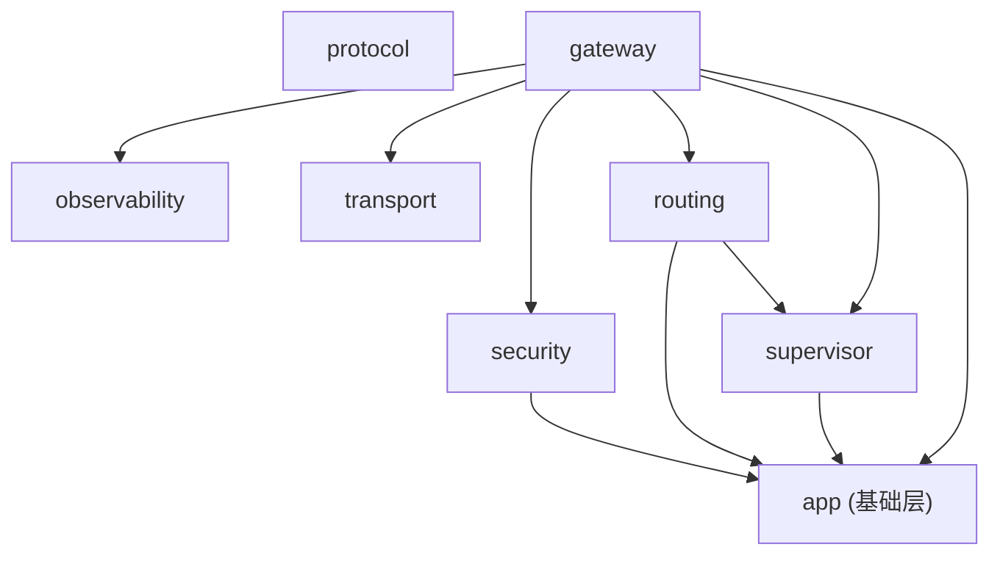

# Hub main.go 模块拆分方案（修订版）

> **文档类型**：开发计划 (devplan)  
> **时间**：2026-03-18 17:53 CST  
> **目标文件**：`hub/cmd/hub/main.go` (1352 行 / 43KB)  
> **信息来源**：基于 `hub/` 目录全部 24 个源文件 + 6 个测试文件的逐文件深度分析

---

## 1. 现状全景

### 1.1 `hub/internal/` 模块职责总览

基于对全部 24 个源文件的逐行阅读，当前 `hub/internal/` 的模块分布如下：

| 包 | 文件 | 行数 | 职责 |
|:---|:---|:---|:---|
| **`app/`** | 16 个文件 | 2770 行 | **大杂烩**：涵盖认证 (`auth.go`)、用户存储 (`user_store.go`)、身份上下文 (`identity.go`)、Hub 平台核心 (`hub_platform.go` 1155行)、运行时配置 (`runtime_config.go`/`public_config.go`)、冒烟测试 (`smoke.go`)、端口占用 (`port_preempt.go`)、日志 (`logger.go`)、版本 (`version.go`)、SQLite 快照 (`startup_snapshot_store.go`)、路径检测 (`runtime_root.go`)、ID 生成 (`id.go`)、时间 (`time.go`)、JSON 工具 (`jsonutil.go`) |
| **`gateway/`** | 1 个文件 | 658 行 | Tool 调用代理 (`tool_handler.go`)：REST/WS 请求选路、转发、审计 |
| **`supervisor/`** | 3 个文件 | 986 行 | 实例注册表 (`registry.go`) + 服务生命周期管理 (`lifecycle.go`) |
| **`routing/`** | 4 个文件 | 736 行 | 工具路由引擎 (`engine.go`)：绑定决策、熔断、评分 + 元数据 Schema (`schema.go`) |
| **`transport/`** | 2 个文件 | 188 行 | TCP/UDS 双传输层 HTTP 客户端 |
| **`observability/`** | 1 个文件 | 73 行 | 审计事件环形缓冲区 |
| **`security/`** | 2 个文件 | 78 行 | Header 清洗 + Caller/HubAuth 注入 |
| **`protocol/`** | 1 个文件 | 13 行 | `toolproto` 类型别名（仅做包级重导出） |

### 1.2 `main.go` 职责分析

将 1352 行按功能域逐段标注：

```
L1-30    import + serviceBindRequest 结构体
L32-64   responseObserver（中间件基础设施）
L66-186  main() 前半段：CLI flag、路径解析、Store/Engine/Manager 初始化
L188-240 请求审计日志中间件（Body 嗅探 ToolID）
L242-283 /api/debug/log Handler
L285-311 /version + /api/config Handler
L313-314 /api/tool/call + /api/tool/ws（委托 ToolHandler）
L316-326 /api/internal/healthz Handler
L328-614 /api/service/* 系列 Handler（5 个：prepare-start/register/heartbeat/drain/unregister）
L616-748 /api/auth/* 系列 Handler（4 个：register/login/logout/me）
L750-934 /api/admin/* 系列 Handler（8 个：services/tools/routes/instances/audits/refresh/bind/tool-probe）
L936-987 /admin/shutdown + 静态文件 + 根路由
L989-1066 smoke-test Handler + Server 启动 + LifecycleManager 编排 + AutoSmokeTest
L1068-1076 writeJSON / writeJSONStatus
L1078-1191 辅助函数：decodeInternalRegister、isLoopbackRemoteAddr、verifyServiceInternalAuth、instanceStatusFromHealth、ensureServiceStoppedForRegister
L1215-1352 进程治理函数：broadcastServiceShutdown、stopServiceRegistration、serviceRuntimeAlive、postServiceShutdown、isServiceEndpointAlive、buildServiceControlURL、isPIDAlive
```

### 1.3 核心问题

1. **`main.go` 既是入口又是业务层**：17 个 Handler 以匿名闭包直接内联在 `main()` 函数内，通过闭包捕获 8+ 外部变量，无法独立测试。

2. **`app/` 包是无边界的大杂烩**：16 个文件跨越认证、存储、配置、日志、冒烟测试等完全不同的领域，全部共享 `package app`。这不是本次拆分的主要目标，但它解释了为什么 Handler 不应该继续扔进 `app/`。

3. **代码重复**：
   - `buildServiceControlURL`：`main.go:1328` 与 `supervisor/lifecycle.go:511` **逐字相同**
   - `main.go` 的 `stopServiceRegistration` / `broadcastServiceShutdown` 与 `lifecycle.go` 的 `stopProcess` / `postShutdown` **功能高度重叠**

4. **既有先例被忽视**：`gateway/tool_handler.go` 已是一个结构体化的 Handler（`ToolHandler`），接受 `AuthService`/`HubPlatform`/`RoutingEngine` 等依赖注入，这是项目已确立的 Handler 模式。

---

## 2. 拆分原则

| 原则 | 说明 |
|:---|:---|
| **遵循既有模式** | Handler 下沉到 `hub/internal/` 子包，沿用 `ToolHandler` 的 struct + DI 模式 |
| **按领域归属** | Handler 放入其语义最相关的现有包，而非新建包（减少包扩散） |
| **`cmd/hub/` 极薄** | `main.go` 仅做 CLI 解析、依赖组装 (DI)、路由注册、Server 启动 |
| **零行为变更** | 纯结构性搬移，不改任何逻辑分支、不改 API 路径、不改 HTTP 行为 |
| **每步可编译** | 每个 Step 完成后 `go build ./hub/cmd/hub/` 必须通过 |

---

## 3. 目标文件结构

```text
hub/
├── cmd/hub/
│   └── main.go                         # 极薄入口 (~120 行)
├── internal/
│   ├── app/
│   │   ├── (现有 16 文件不变)
│   │   └── ...
│   ├── gateway/
│   │   ├── tool_handler.go             # 已有，保持不变
│   │   ├── admin_handler.go            # [NEW] Admin API Handler 组
│   │   ├── system_handler.go           # [NEW] System/杂项 Handler 组
│   │   ├── middleware.go               # [NEW] 请求审计日志中间件
│   │   └── httputil.go                 # [NEW] writeJSON / writeJSONStatus / responseObserver
│   ├── supervisor/
│   │   ├── lifecycle.go                # 已有，修改：导出 BuildServiceControlURL
│   │   ├── registry.go                 # 已有，保持不变
│   │   ├── registry_test.go            # 已有，保持不变
│   │   ├── handler.go                  # [NEW] Supervisor API Handler 组
│   │   └── process_control.go          # [NEW] 进程治理函数（从 main.go 下沉）
│   ├── routing/                        # 保持不变
│   ├── transport/                      # 保持不变
│   ├── observability/                  # 保持不变
│   ├── security/                       # 保持不变
│   └── protocol/                       # 保持不变
```

---

## 4. 详细拆分方案

### 4.1 Step 1: `gateway/httputil.go` — HTTP 响应工具

**从 `main.go` 提取**：

| 内容 | 原始位置 |
|:---|:---|
| `responseObserver` struct + 3 个方法 | L32-64 |
| `writeJSON()` | L1068-1070 |
| `writeJSONStatus()` | L1072-1076 |

**设计**：这些是通用 HTTP 基础设施，被所有 Handler 组共享。放入 `gateway/` 因为 Gateway 是 HTTP 流量的入口层。全部导出为 `WriteJSON` / `WriteJSONStatus` / `ResponseObserver`。

**依赖**：仅依赖标准库 `net/http`、`encoding/json`。无循环依赖风险。

---

### 4.2 Step 2: `gateway/middleware.go` — 请求审计日志中间件

**从 `main.go` 提取**：

| 内容 | 原始位置 |
|:---|:---|
| 请求审计日志中间件（含 ToolID body peek） | L188-240 |

**设计**：

```go
// gateway/middleware.go
package gateway

// NewLoggingMiddleware 返回审计日志中间件（System:HTTP: 类型日志）
// silentPrefixes: 不记录的路径前缀列表（如 "/api/service/"）
func NewLoggingMiddleware(handler http.Handler, silentPrefixes []string) http.Handler
```

**依赖**：`app.IdentityFromContext`、`app.InfofCtxTag` — 与 `tool_handler.go` 已有的依赖完全一致，无新依赖引入。

---

### 4.3 Step 3: `supervisor/handler.go` — Supervisor API Handler 组

**从 `main.go` 提取**：

| 内容 | 原始位置 |
|:---|:---|
| `/api/service/prepare-start` Handler | L328-380 |
| `/api/service/register` Handler | L382-467 |
| `/api/service/heartbeat` Handler | L469-527 |
| `/api/service/drain` Handler | L529-574 |
| `/api/service/unregister` Handler | L576-614 |
| `decodeInternalRegister()` 辅助函数 | L1078-1154 |
| `isLoopbackRemoteAddr()` 辅助函数 | L1156-1163 |
| `verifyServiceInternalAuth()` 辅助函数 | L1165-1184 |
| `instanceStatusFromHealth()` 辅助函数 | L1186-1191 |
| `ensureServiceStoppedForRegister()` 辅助函数 | L1193-1213 |

**设计**：沿用 `ToolHandler` 模式，创建 `SupervisorHandler` 结构体：

```go
// supervisor/handler.go
package supervisor

type SupervisorHandler struct {
    hubPlatform  *app.HubPlatform
    registry     *Registry
    routingEngine *routing.Engine
    auditStore   *observability.Store
}

func NewSupervisorHandler(
    hubPlatform *app.HubPlatform,
    registry *Registry,
    routingEngine *routing.Engine,
    auditStore *observability.Store,
) *SupervisorHandler

func (h *SupervisorHandler) HandlePrepareStart(w http.ResponseWriter, r *http.Request)
func (h *SupervisorHandler) HandleRegister(w http.ResponseWriter, r *http.Request)
func (h *SupervisorHandler) HandleHeartbeat(w http.ResponseWriter, r *http.Request)
func (h *SupervisorHandler) HandleDrain(w http.ResponseWriter, r *http.Request)
func (h *SupervisorHandler) HandleUnregister(w http.ResponseWriter, r *http.Request)
```

**为什么放 `supervisor/`**：
- 这 5 个 Handler 操作的核心对象是 `Registry` 和 `HubPlatform` 的服务注册数据
- `ensureServiceStoppedForRegister` 已调用 `lifecycle.go` 中的进程控制逻辑
- 辅助函数 `decodeInternalRegister` 直接构造 `app.HubServiceRegisterRequest`，语义上属于 Supervisor 领域
- `supervisor/` 包当前已依赖 `app`、`hubsvc`，新增 `routing`、`observability`、`gateway`（仅用 `WriteJSON`）依赖不构成循环

**依赖关系检验**（关键，防循环）：

```
supervisor/handler.go → app (已有), routing (新增), observability (新增), gateway (新增)
gateway/tool_handler.go → supervisor (已有)
```

> ⚠️ **循环风险**：`supervisor → gateway` 和 `gateway → supervisor` 将构成循环！
>
> **解决方案**：`SupervisorHandler` 不依赖 `gateway` 包。`writeJSON` / `writeJSONStatus` 改为放在一个无依赖的独立位置。有两个选项：
>
> - **选项 A**：放入 `app/` 包（它已经是最底层的基础包，所有包都依赖它）
> - **选项 B**：放入一个新的 `internal/httpkit/` 包（纯工具、无业务依赖）
>
> **推荐选项 A**：`app/` 已包含 `jsonutil.go` 等工具函数，`writeJSON` 放入 `app/httputil.go` 是自然延伸。这样 `supervisor`、`gateway` 都可以引用而不产生循环。

**修正后的依赖方案**：

```
app/httputil.go       → 标准库 (net/http, encoding/json)
gateway/middleware.go  → app (已有)
gateway/tool_handler.go → app, supervisor, routing, observability, security, transport (全已有)
supervisor/handler.go  → app (已有), routing (新增), observability (新增)
```

✅ 无循环依赖。

---

### 4.4 Step 4: `supervisor/process_control.go` — 进程治理函数

**从 `main.go` 提取**：

| 内容 | 原始位置 |
|:---|:---|
| `broadcastServiceShutdown()` | L1215-1247 |
| `stopServiceRegistration()` | L1249-1288 |
| `serviceRuntimeAlive()` | L1290-1297 |
| `postServiceShutdown()` | L1299-1315 |
| `isServiceEndpointAlive()` | L1317-1326 |
| `isPIDAlive()` | L1346-1352 |

**同时消除重复**：

- `main.go` 中的 `buildServiceControlURL` (L1328-1344) → **删除**，改用 `lifecycle.go` 中已有的版本
- 将 `lifecycle.go:511` 的 `buildServiceControlURL` 改为导出 `BuildServiceControlURL`
- `lifecycle.go` 内部的 `postShutdown` 也改为调用 `process_control.go` 中统一的 `PostServiceShutdown`

**设计**：这些函数全部导出，放在 `supervisor/process_control.go`：

```go
// supervisor/process_control.go
package supervisor

func BroadcastServiceShutdown(hubPlatform *app.HubPlatform, timeout time.Duration)
func StopServiceRegistration(reg app.HubServiceRegistration, timeout time.Duration) error
func ServiceRuntimeAlive(endpoint string, pid int) (endpointAlive bool, pidAlive bool)
func PostServiceShutdown(shutdownURL string) error
func IsServiceEndpointAlive(healthzURL string) bool
func BuildServiceControlURL(endpoint string, targetPath string) string
func IsPIDAlive(pid int) bool
```

---

### 4.5 Step 5: `gateway/admin_handler.go` — Admin API Handler 组

**从 `main.go` 提取**：

| 内容 | 原始位置 |
|:---|:---|
| `/api/admin/services` Handler | L750-765 |
| `/api/admin/services/tools` Handler | L767-782 |
| `/api/admin/services/routes` Handler | L784-807 |
| `/api/admin/services/instances` Handler | L809-823 |
| `/api/admin/services/audits` Handler | L825-846 |
| `/api/admin/services/refresh` Handler | L848-865 |
| `/api/admin/services/bind` Handler | L867-897 |
| `/api/admin/services/tool-probe` Handler | L899-934 |
| `serviceBindRequest` struct | L32-35 |

**设计**：

```go
// gateway/admin_handler.go
package gateway

type AdminHandler struct {
    authService    *app.AuthService
    hubPlatform    *app.HubPlatform
    registry       *supervisor.Registry
    routingEngine  *routing.Engine
    auditStore     *observability.Store
    toolHandler    *ToolHandler
}

func NewAdminHandler(...) *AdminHandler
func (h *AdminHandler) HandleServices(w, r)
func (h *AdminHandler) HandleTools(w, r)
func (h *AdminHandler) HandleRoutes(w, r)
func (h *AdminHandler) HandleInstances(w, r)
func (h *AdminHandler) HandleAudits(w, r)
func (h *AdminHandler) HandleRefresh(w, r)
func (h *AdminHandler) HandleBind(w, r)
func (h *AdminHandler) HandleToolProbe(w, r)
```

**为什么放 `gateway/`**：Admin API 是面向前端管理面板的网关接口，与 `ToolHandler` 同属 "Gateway 对外暴露的 HTTP 接口" 层。它们共享相同的鉴权模式（JWT）和响应格式。

**依赖**：`app`、`supervisor`、`routing`、`observability` — 与 `ToolHandler` 已有的依赖完全一致。

---

### 4.6 Step 6: `gateway/system_handler.go` — System/杂项 Handler 组

**从 `main.go` 提取**：

| 内容 | 原始位置 |
|:---|:---|
| `/api/debug/log` Handler | L242-283 |
| `/version` Handler | L285-287 |
| `/api/config` Handler (GET/PUT) | L289-311 |
| `/api/internal/healthz` Handler | L316-326 |
| `/api/system/smoke-test` Handler | L989-1013 |
| `/admin/shutdown` Handler | L936-978 |
| `/` 根路由 + 静态文件 | L980-987 |
| Auth 系列 Handler（4 个） | L617-748 |

**设计**：

```go
// gateway/system_handler.go
package gateway

type SystemHandler struct {
    authService      *app.AuthService
    userStore        *app.UserStore
    hubPlatform      *app.HubPlatform
    runtimeCfg       *app.RuntimeConfigManager
    version          *app.VersionInfo
    lifecycleManager *supervisor.LifecycleManager
    webuiRoot        string
    addr             string

    // 以下两个字段在 Server 创建后由 main.go 回填
    Server    *http.Server
    AppCancel context.CancelFunc
}

func NewSystemHandler(...) *SystemHandler

// Auth
func (h *SystemHandler) HandleAuthRegister(w, r)
func (h *SystemHandler) HandleAuthLogin(w, r)
func (h *SystemHandler) HandleAuthLogout(w, r)
func (h *SystemHandler) HandleAuthMe(w, r)

// System
func (h *SystemHandler) HandleDebugLog(w, r)
func (h *SystemHandler) HandleVersion(w, r)
func (h *SystemHandler) HandleConfig(w, r)
func (h *SystemHandler) HandleHealthz(w, r)
func (h *SystemHandler) HandleSmokeTest(w, r)
func (h *SystemHandler) HandleShutdown(w, r)
func (h *SystemHandler) HandleStaticFiles(w, r)
```

**Auth Handler 为什么也放 `gateway/`（而非 `app/`）**：
- Auth Handler 是 HTTP 层端点逻辑，它**调用** `app.AuthService` 和 `app.UserStore` 的方法但**不属于**它们。如果把 Handler 放入 `app/` 包，会让 `app/` 的大杂烩问题更加严重
- Auth Handler 使用 `http.SetCookie`、`json.NewDecoder(r.Body)` 等 HTTP 层操作，这是 Gateway 的职责
- `gateway/` 包的定位就是 "Hub 对外暴露的所有 HTTP 接口"

> **关于 `Server` 和 `AppCancel` 回填**：`HandleShutdown` 需要访问 `*http.Server` 来关闭 HTTP 服务。但 Server 在路由注册之后才创建。解决方案：`SystemHandler` 创建时这两个字段为 nil，`main.go` 在创建 Server 后立即赋值 `systemHandler.Server = server`。由于 `/admin/shutdown` 只接受 loopback 请求，且发生在 Server 完全启动之后，竞态风险为零。

---

### 4.7 Step 7: `main.go` 瘦身

**最终 `main.go` 结构**（约 120 行）：

```go
package main

func main() {
    // 1. CLI Flag 解析（直接在 main 中，无需独立 config.go —— flag 数量不多）
    publicConfigPath := flag.String(...)
    ...
    flag.Parse()

    // 2. 基础初始化
    app.InitLogger(...)
    app.EnsurePortReady(...)
    appRoot, _ := app.DetectAppRoot()
    // 路径解析...

    // 3. Store / Engine / Manager 初始化
    runtimeCfg, _ := app.NewRuntimeConfigManager(...)
    userStore, _ := app.NewUserStore(...)
    authService, _ := app.NewAuthService(...)
    hubPlatform, _ := app.NewHubPlatform(...)
    supervisorRegistry := supervisor.NewRegistry()
    routingEngine := routing.NewEngine()
    auditStore := observability.NewStore(3000)
    transportClient := transport.NewClient(true)

    // 4. Handler 组创建
    toolHandler := gateway.NewToolHandler(...)
    supervisorHandler := supervisor.NewSupervisorHandler(...)
    adminHandler := gateway.NewAdminHandler(...)
    systemHandler := gateway.NewSystemHandler(...)

    // 5. 路由注册
    mux := http.NewServeMux()
    // Supervisor routes
    mux.HandleFunc("/api/service/prepare-start", supervisorHandler.HandlePrepareStart)
    mux.HandleFunc("/api/service/register", supervisorHandler.HandleRegister)
    ...
    // Tool routes
    mux.HandleFunc("/api/tool/call", toolHandler.HandleCall)
    mux.HandleFunc("/api/tool/ws", toolHandler.HandleWS)
    // Admin routes
    mux.HandleFunc("/api/admin/services", adminHandler.HandleServices)
    ...
    // System routes
    mux.HandleFunc("/api/auth/register", systemHandler.HandleAuthRegister)
    ...
    mux.HandleFunc("/", systemHandler.HandleStaticFiles)

    // 6. 中间件 + Server
    identityMw := app.IdentityMiddleware(authService, hubPlatform)
    loggingMw := gateway.NewLoggingMiddleware(mux, ...)
    server := &http.Server{Addr: *addr, Handler: identityMw(loggingMw)}
    systemHandler.Server = server
    systemHandler.AppCancel = appCancel

    // 7. 启动 + LifecycleManager + AutoSmokeTest
    go func() { serverErrCh <- server.ListenAndServe() }()
    // lifecycle startup...
}
```

**不再需要独立的 `config.go`**：CLI flag 只有 ~10 个，全部在 `main()` 开头声明即可，无需额外抽象。

---

## 5. 消除重复：`buildServiceControlURL` 统一方案

| 当前位置 | 处理方式 |
|:---|:---|
| `main.go:1328` | **删除** |
| `supervisor/lifecycle.go:511` | 重命名为导出 `BuildServiceControlURL`，同时修改 `lifecycle.go` 内部 3 处调用点 |
| `supervisor/process_control.go`（新） | 直接调用 `BuildServiceControlURL` |

同理，`lifecycle.go` 中的私有 `postShutdown()` (L492-509) 改为调用 `process_control.go` 的 `PostServiceShutdown()`。

---

## 6. 依赖关系验证

最终的包依赖图（仅 `hub/internal/` 内部）：



**无循环依赖**。关键是 `supervisor → gateway` 这条边**不存在**（`WriteJSON` 放在 `app/` 中，`supervisor/handler.go` 只依赖 `app`）。

---

## 7. 执行顺序

```
Step 1: app/httputil.go          (+WriteJSON/WriteJSONStatus/ResponseObserver)
Step 2: gateway/middleware.go     (+NewLoggingMiddleware)
Step 3: supervisor/handler.go     (+SupervisorHandler, 5个Handler + 辅助函数)
Step 4: supervisor/process_control.go (+6进程治理函数 + lifecycle.go 去重)
Step 5: gateway/admin_handler.go  (+AdminHandler, 8个Handler)
Step 6: gateway/system_handler.go (+SystemHandler, Auth 4个 + System 7个 Handler)
Step 7: main.go 瘦身             (删减至 ~120行)
```

**每步完成后必须**：`go build ./hub/cmd/hub/` 通过。

---

## 8. 行数估算

| 文件 | 预估行数 | 说明 |
|:---|:---|:---|
| `app/httputil.go` | ~50 | ResponseObserver + WriteJSON |
| `gateway/middleware.go` | ~70 | 审计日志中间件 |
| `gateway/admin_handler.go` | ~220 | 8 个 Admin Handler |
| `gateway/system_handler.go` | ~300 | Auth 4 个 + System 7 个 Handler |
| `supervisor/handler.go` | ~350 | 5 个 Supervisor Handler + 辅助函数 |
| `supervisor/process_control.go` | ~130 | 7 个进程治理函数 |
| `main.go`（瘦身后） | ~120 | CLI + DI + 路由注册 + 启动 |
| **新增/修改总计** | ~1240 | 加上 lifecycle.go 小改 |

原始 `main.go` 1352 行 → 分散到 7 个文件 + 瘦身后 120 行。行数总量基本持平（纯重构预期）。

---

## 9. 验证方案

### 9.1 编译验证

```bash
# 每个 Step 完成后执行
cd /Users/zhyuzh/BaiduTongbu/2026.03.03kagent/kagent
go build ./hub/cmd/hub/
go vet ./hub/...
```

### 9.2 现有测试

项目中已有 6 个测试文件：

```
hub/internal/app/identity_test.go        (208行)
hub/internal/routing/engine_test.go      (2715B)
hub/internal/routing/schema_test.go      (3332B)
hub/internal/security/headers_test.go    (2826B)
hub/internal/supervisor/registry_test.go (1697B)
hub/internal/transport/client_test.go    (1941B)
```

运行全部现有测试：

```bash
cd /Users/zhyuzh/BaiduTongbu/2026.03.03kagent/kagent
go test ./hub/...
```

所有测试必须全部通过（纯重构不应破坏任何现有测试）。

### 9.3 端到端验证

```bash
# 一键部署
cd /Users/zhyuzh/BaiduTongbu/2026.03.03kagent/kagent/scripts
./deploy.sh

# 等待启动完成后检查：
# 1. Hub 健康检查
curl http://127.0.0.1:18080/api/internal/healthz
# 预期: {"ok":true, "timestamp_ms":...}

# 2. 版本接口
curl http://127.0.0.1:18080/version
# 预期: {"format":"calver-yymmddnn", "backend":"...", "webui":"..."}

# 3. 查看 Hub 日志中是否出现 AutoSmokeTest 成功
# 预期: 日志中出现 "System:Internal:AutoSmokeTest:Success"
```

### 9.4 完成标准

- [ ] `go build ./hub/cmd/hub/` 编译通过
- [ ] `go vet ./hub/...` 无 warning
- [ ] `go test ./hub/...` 全部通过
- [ ] `deploy.sh` 一键部署成功
- [ ] Hub 日志中 `System:Internal:AutoSmokeTest:Success` 出现
- [ ] `main.go` 行数 ≤ 150 行

---

## 10. 不在本次范围内的优化

1. **`app/` 包拆分**：`hub_platform.go` (1155行) 本身也值得拆分（路由绑定、认证、工具注册分离），但这属于独立任务
2. **`protocol/` 包清理**：`doc.go` 仅含类型别名且未被任何包实际引用，可考虑删除
3. **Handler 接口化**：进一步将 `SystemHandler` 拆为 `AuthHandler` + `ConfigHandler` + `ShutdownHandler` 等更细粒度的结构体
4. **引入路由库**：使用 `chi` / `gorilla/mux` 替代 `http.ServeMux` 以获得路由分组能力

---

*文档结束*
