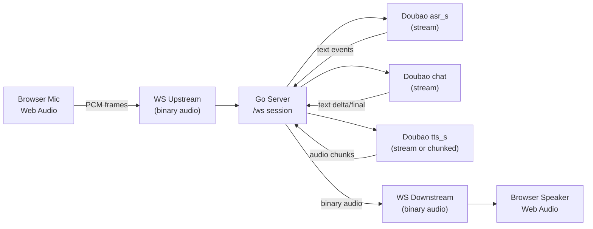

# T0-2026-03-03-01 — 最小可用实时语音对话系统（MVP）需求文档

- 文档版本：01
- 状态：Draft（可执行规格）
- 最后更新：2026-03-03 20:49 CST
- 代号与定位：T0 / Trinity Zero / C.A.T Zero（第一代“三自体核心”起步能力：实时语音对话）
- 信息来源与依据：
  - 本对话中的需求描述（用户确认）
  - `ref/doubao-doc.md`（仅作为“官方文档入口索引”，具体字段/协议以其链接指向的官方文档为准）
  - 仓库现状：当前为骨架仓库（`doc/_instruction.md` 描述），本需求将落地最小 Go 服务 + 彻底无编译无 Node.js 的纯原生 HTML/JS 前端，坚决不引入非必要的第三方工具。

## 1. 目标与边界

### 1.1 MVP 目标（必须达成）
在本地 Mac（localhost）运行一个“最小可用”的实时语音聊天页面，完成端到端闭环：

1. 浏览器采集麦克风音频（Web Audio API）
2. 通过 WebSocket 将音频**持续流式**发送到 Go 后端
3. 后端调用豆包流式 ASR（`asr_s`）进行识别，得到文本（增量/最终）
4. 将识别文本发送到豆包流式对话（`chat`，流式输出）
5. 将对话输出文本送豆包流式 TTS（`tts_s`），合成语音（流式返回）
6. 后端将语音流回传浏览器并播放
7. 支持“用户说话打断 AI 说话”（barge-in）

> 说明：本文档对“流式”采取工程化定义（见 2.3、6、7），避免“名义流式但实际整段等待”的假流式实现。

### 1.2 非目标（明确不做）
- 不实现数据库
- 不实现记忆系统
- 不实现人格设定
- 不实现进化逻辑
- 不实现账号、鉴权、多人房间（单用户、单页面会话即可）
- 不做公网部署（仅本机 `127.0.0.1`/`localhost`）

### 1.3 成功标准（用户体验）
- 一键 Start/Stop
- 可持续对话：用户说一句，AI 以语音回复
- “体感实时”：用户停顿后，系统在合理时间内开始响应（见 10.2 指标）
- 打断有效：AI 播放中用户开口可停止 AI 并转入识别

## 2. 关键定义（让需求可验证）

### 2.1 “最小可用（MVP）”
满足以下即可视为 MVP 通过：
- 端到端链路可运行（采集 → WS → ASR → LLM → TTS → 播放）
- 错误可见（状态栏能显示 Error + 关键原因）
- Stop 能可靠释放资源（断开 WS、停止采集、停止播放）

### 2.2 “实时”
不追求最优架构，但必须避免明显的“长时间无反馈”。最低要求：
- 前端采集后以固定帧率/分片持续发送音频（不是一次性录完再上传）
- 后端在收到 ASR 增量或最终后能及时把状态/文本事件推送前端
- LLM 与 TTS 的输出要能以流式/分段方式推动播放，而非等待整段完成才播放（若官方 API 限制导致无法真正流式，必须在“待确认项”中显式说明并选择最小可行替代策略）

### 2.3 “全流式（工程化口径）”
以下至少满足其一：
- **链路级流式**：ASR 输入为连续帧；LLM 输出为增量；TTS 音频为连续块下行；浏览器连续播放。
- **分段近实时（可接受下限）**：LLM 输出按句/短语切分触发多次 TTS（每段尽量短），实现“边生成边说”效果；每段音频下行可连续播放并支持中断。

## 3. 系统架构（最小实现）

### 3.1 组件
- Browser（彻底无编译无 Node.js 的纯原生 HTML/JS/WebComponent）
- Go HTTP Server（本地，无非必要第三方框架）
- Doubao ASR（`asr_s`）、Doubao Chat（`chat`）、Doubao TTS（`tts_s`）

### 3.2 数据流（逻辑）

### 3.3 绑定与安全范围
- 服务默认仅监听 `127.0.0.1`（避免局域网暴露）
- 前端页面通过 `http://127.0.0.1:<port>/webui/index.html` 访问（兼容：`/static/index.html`）
- 麦克风权限：现代浏览器对 `localhost` 通常视为安全上下文，可在 HTTP 下使用 `getUserMedia`；如遇限制，则升级为本地 HTTPS（**非 MVP 必选**，作为后续增强项）

## 4. UI 需求（最简但可调试）

### 4.1 页面元素（必须）
- Start 按钮：开始采集、建立 WS、进入 Listening
- Stop 按钮：停止采集、关闭 WS、停止播放、回到 Idle
- Status 区：显示状态 + 简短说明

### 4.2 调试显示（建议，强烈推荐）
- ASR Partial/Final 文本框
- LLM Delta/Final 文本框
- 统计信息（可选）：上行帧率、当前延迟估计、播放队列长度

## 5. 会话与回合（turn）模型

### 5.1 会话（session）
- 一个浏览器页面打开后建立 1 条 WebSocket 连接视为一个 session
- session 内可产生多个“回合（turn）”

### 5.2 回合（turn）的工程定义（MVP）
- 用户“说完一段”（utterance）后触发一次 LLM 请求，并得到一段（或多段）TTS 播放
- utterance 的结束判定见 8.3

### 5.3 关联标识（必须）
为保证取消/打断的可控性，要求每个 turn 有唯一 `turn_id`：
- 后端生成（递增或 UUID）
- 所有事件/音频下行都带 `turn_id`（见 7.3）

## 6. Barge-in（用户打断 AI）规格

### 6.1 行为（必须）
当系统处于 Speaking（AI 正在播放）时，用户开口：
- 浏览器：立即停止播放（停止/断开当前播放队列），并发送 `interrupt` 控制消息
- 后端：立即取消当前 turn 的 LLM/TTS（以及相关在途处理），并转入 Listening/Recognizing

### 6.2 触发策略（MVP 可行且可调）
推荐“双触发”冗余，减少误判：
- 前端触发：基于麦克风能量阈值（RMS）判断“用户开始说话”
- 后端触发：当处于 Speaking 且收到新的有效音频帧时，视为潜在打断（可在后端再加一次阈值/VAD 判定）

### 6.3 误打断风险与约束（必须写清）
由于回声/扬声器外放，可能造成误触发：
- 前端必须开启 `echoCancellation/noiseSuppression/autoGainControl`
- 前端能量阈值要可配置（常量或 UI 滑条，MVP 可先常量）
- 后端应以“宁可稍慢打断，也不能频繁误打断”为原则，默认阈值偏保守

## 7. WebSocket 协议（最小且可演进）

### 7.1 连接
- URL：`ws://127.0.0.1:<port>/ws`
- 单连接复用：
  - 前端→后端：音频（二进制） + 控制消息（JSON 文本）
  - 后端→前端：事件（JSON 文本） + TTS 音频（二进制）

### 7.2 前端→后端：控制消息（JSON 文本）
必须支持：
- `{"type":"start"}`
- `{"type":"stop"}`
- `{"type":"interrupt","reason":"barge_in|manual"}`（reason 可选）
- `{"type":"utterance_end"}`（如采用前端静音检测分句）

### 7.3 后端→前端：事件消息（JSON 文本）
所有事件必须包含：
- `type`
- `ts_ms`（后端事件发生的本地时间戳，毫秒）
- `turn_id`（无 turn 时可为空或 0）

最少事件集（必须）：
- `status`：`{"type":"status","value":"Idle|Connecting|Listening|Recognizing|Thinking|Speaking|Interrupted|Error","detail":"...","ts_ms":...,"turn_id":...}`
- `error`：`{"type":"error","code":"...","message":"...","recoverable":true,"ts_ms":...,"turn_id":...}`

建议事件集（强烈建议，便于验证流式）：
- `asr_partial`：`{"type":"asr_partial","text":"...","ts_ms":...,"turn_id":...}`
- `asr_final`：`{"type":"asr_final","text":"...","ts_ms":...,"turn_id":...}`
- `llm_delta`：`{"type":"llm_delta","text":"...","ts_ms":...,"turn_id":...}`
- `llm_final`：`{"type":"llm_final","text":"...","ts_ms":...,"turn_id":...}`

### 7.4 二进制音频下行（后端→前端）
要求：
- 二进制帧代表一段可播放音频数据（chunk）
- 必须与事件流通过 `turn_id` 对齐（做法二选一）：
  1) 每个音频 chunk 前先发一条 JSON 事件 `{"type":"tts_chunk","seq":n,"format":"...","turn_id":...}`，随后发送对应 binary
  2) 将 `turn_id/seq/format` 放入 binary 自定义头（实现更复杂；MVP 不推荐）

> MVP 推荐方案：事件 + binary 成对发送，浏览器按 seq 入队播放。

## 8. 音频采集、格式与分句

### 8.1 采集（必须）
- 使用 `getUserMedia({audio:{echoCancellation:true,noiseSuppression:true,autoGainControl:true}})`
- 采集后用 AudioWorklet（优先）或 ScriptProcessor（兜底）获得 PCM 流

### 8.2 上行音频格式（默认决策 + 待确认）
为实现可行性，MVP 先做“明确默认”，并在实现前对齐官方接口：
- **默认目标格式**：PCM16LE、mono、16kHz
- 前端若采集到 48kHz float，则需重采样 + float→int16 转换

待确认项（实现前必须从官方文档核对）：
- `asr_s` 支持/要求的采样率、位宽、声道、编码、分片策略、是否需要头部元信息

### 8.3 utterance_end（用户一句结束）策略（MVP）
至少实现一种，并写入实现选择：
- A. 前端静音检测（RMS 低于阈值持续 600–900ms）→ 发 `utterance_end`
- B. 依赖 ASR 端点检测（ASR 返回 final/endpoint 事件）→ 后端触发 turn 结束

推荐：优先 B（更稳），若官方接口不提供端点信息，则用 A。

## 9. 后端职责与代码结构（必须按约束落地）

### 9.1 代码结构（用户指定）
- `main.go`：启动服务、加载配置、路由（静态 + WS）、生命周期管理
- `webui/index.html`：最简 UI + 采集/WS/播放逻辑（坚持极其克制，采用纯原生 JS，**无 Node.js、无编译构建步骤、不引入任何非必要的第三方前端框架与库**）
- `internal/asr.go`：豆包 `asr_s` 封装（流式输入、增量输出、可取消）
- `internal/llm.go`：豆包 `chat` 封装（流式输出、可取消）
- `internal/tts.go`：豆包 `tts_s` 封装（流式/分段输出、可取消）

> 允许新增极少量辅助文件（例如 `internal/config.go`）以保持简洁与可读性，**但坚决不引入复杂的外部第三方框架与库，保持 Go 后端极简原生**。

### 9.2 配置读取（必须）
- 仅从 `config/configx.json` 读取（前端不可读取/不可下发）
- 任何日志不得打印真实 key/token（只打印字段名或掩码）

> 注：需求中出现 “Xconfig.json” 应统一为仓库现有文件名 `configx.json`（当前路径为 `config/configx.json`）。

### 9.3 取消与资源释放（必须）
- 每个 turn 必须绑定一个 `context.Context`
- 收到 `stop/interrupt` 必须：
  - cancel turn context
  - 关闭与豆包相关的流式连接（按官方方式）
  - 清空待处理队列
  - 更新状态并通知前端

### 9.4 背压与队列（必须给出策略）
实时系统不能无限缓存，MVP 需选择并实现一种明确策略：
- 上行音频队列：固定容量（例如 N 帧）；满时丢弃最旧帧（保证“新鲜度”优先）
- 下行 TTS 队列：固定容量；满时停止生成/丢弃未来 chunk，并向前端发 `error` 或 `status` 告警

### 9.5 失败恢复（必须）
- WS 断线：后端立即取消当前 turn 并释放资源
- 豆包调用失败：向前端发 `error`，并回到 Listening 或 Idle（视是否还能继续采集）
- 允许用户重新 Start 进入新 session（或复用同一页面重连）

## 10. 指标、验收与测试

### 10.1 功能验收（DoD）
- Start 后能看到状态变化：Connecting → Listening
- 说话时能看到（至少）ASR final
- AI 能语音回复并播放
- Stop 后：麦克风停止、WS 关闭、播放停止、状态回 Idle
- Speaking 时用户开口：≤ 1s 内停止 AI 播放并进入识别

### 10.2 实时体验指标（建议目标，非硬性 SLA）
为“更科学可评估”，建议记录以下测量点（仅用于本地调参）：
- `t_u_end`：用户停顿并触发 utterance_end 的时间
- `t_asr_final`：ASR final 到达时间
- `t_llm_first`：LLM 首个 delta 到达时间
- `t_tts_first_audio`：首个可播放音频 chunk 到达时间
- `t_play_start`：浏览器开始播放时间

建议目标（MVP）：
- `t_play_start - t_u_end` 尽量 < 2.5s（受网络与模型影响，仅做方向性指标）

### 10.3 手工测试清单（MVP）
- 正常对话：短句/长句/连续多轮
- Stop 测试：Listening/Thinking/Speaking 任意阶段 Stop 都能回收
- 打断测试：AI 说话中断三次以上，仍能继续对话（无卡死）
- 噪声测试：背景噪声下静音检测不过度误触发 utterance_end（如采用前端静音）
- 音频设备切换：拔插耳机/切换输入（可作为已知限制，MVP 可不完全覆盖，但要有错误提示）

## 11. 待确认项（实现前必须对齐官方文档）
由于 `ref/doubao-doc.md` 当前仅提供入口链接，以下必须在动手实现前逐项确认并记录到实现笔记或补充文档：
- `asr_s`：
  - 传输协议（HTTP streaming / WebSocket / 其他）
  - 输入音频格式要求（采样率/编码/分片大小/是否带头）
  - 返回事件类型（partial/final/endpoint 等）与字段
  - 是否支持客户端显式结束（end-of-stream）与取消
- `chat`：
  - 流式响应协议与解析方式（SSE/Chunked JSON 等）
  - 停止生成（cancel）是否有官方语义
- `tts_s`：
  - 文本输入是否支持增量（streaming input）或仅支持整段
  - 音频输出格式选择（PCM/MP3/Opus 等）与浏览器流播可行性
  - 取消与中断语义

## 12. 实现策略建议（提高可行性但不扩大范围）
为保证“先跑起来”，建议采用以下优先级：
1. **先跑通链路**：ASR final → LLM → 单次 TTS → 一次性播放（可作为最小闭环验证）
2. **再做近实时**：LLM delta 按短语切分触发多次 TTS（分段播放）
3. **最后稳态优化**：真正的流式 TTS 音频 chunk 播放 + 更稳的 utterance_end + 更低误打断

> 若官方 `tts_s` 明确支持“边输入边输出音频”，则跳过第 2 步的分段折中，直接实现真正流式。
